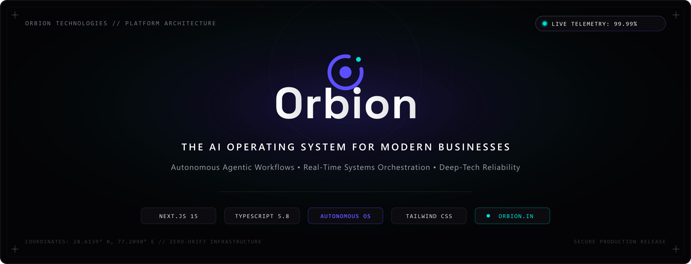
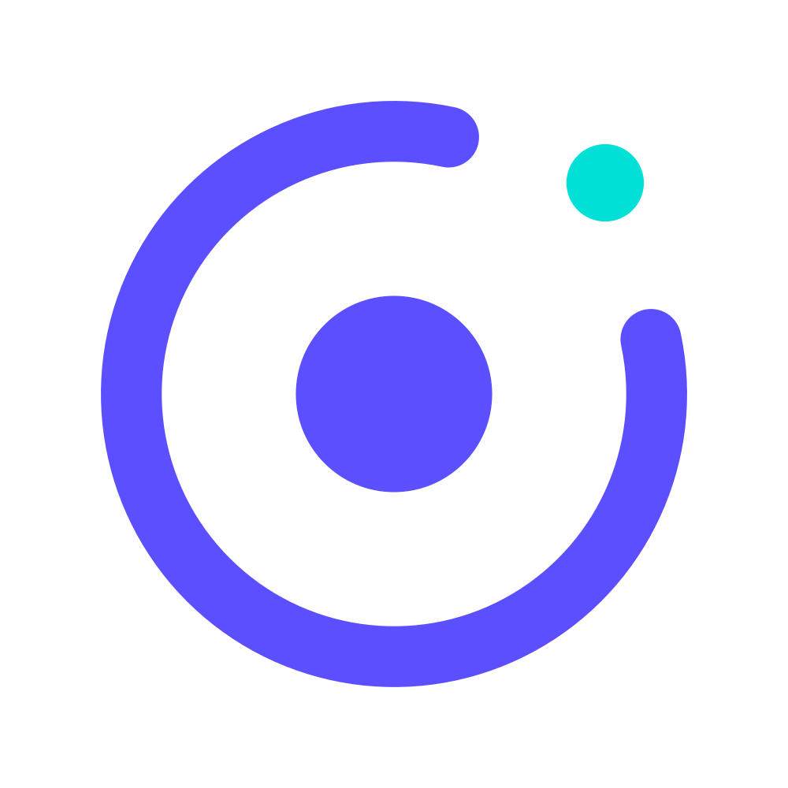

<p align="center">
  <picture>
    <source media="(prefers-color-scheme: dark)" srcset="public/brand/png/orbion-banner.png">
    <source media="(prefers-color-scheme: light)" srcset="public/brand/png/orbion-banner.png">
    
  </picture>
</p>

<p align="center">
  <a href="https://orbion.in">
    <picture>
      <source media="(prefers-color-scheme: dark)" srcset="public/brand/svg/orbion-logo-horizontal.svg">
      <source media="(prefers-color-scheme: light)" srcset="public/brand/svg/orbion-logo-technologies-purple.svg">
      
    </picture>
  </a>
</p>

<h3 align="center">The AI Operating System for Modern Businesses</h3>

<p align="center">
  <em>Autonomous Agentic Workflows • Real-Time Systems Orchestration • Deep-Tech Reliability</em>
</p>

<p align="center">
  <a href="https://orbion-in.vercel.app/"></a>
  <a href="https://orbion-in.vercel.app/"></a>
  <a href="https://nextjs.org"></a>
  <a href="https://www.typescriptlang.org"></a>
  <a href="https://tailwindcss.com"></a>
  <a href="https://www.prisma.io"></a>
  <a href="https://better-auth.com"></a>
</p>

<p align="center">
  <a href="https://orbion.in">🌐 <b>Live Platform</b></a> &nbsp;•&nbsp;
  <a href="#1-project-philosophy--design-direction">📐 <b>Design System</b></a> &nbsp;•&nbsp;
  <a href="#3-authentication-architecture">🔐 <b>Authentication</b></a> &nbsp;•&nbsp;
  <a href="#4-local-development--scripts">⚡ <b>Quickstart</b></a> &nbsp;•&nbsp;
  <a href="#5-deployment-guide">🚀 <b>Deployment</b></a> &nbsp;•&nbsp;
  <a href="#7-brand-identity--assets">🎨 <b>Brand Assets</b></a>
</p>

---

## 1. Project Philosophy & Design Direction
Orbion Technologies is an early-stage deep-tech startup building an **AI Operating System** designed to help businesses automate and operate their everyday workflows through autonomous, intelligent agentic systems.

### Core Design Rules
* **No Generic AI Tropes**: Avoided robot illustrations, AI brain graphics, neon glows, particle fields, floating glass cards, and fake statistics.
* **Black & White Dominance**: High-contrast architectural minimalism inspired by Apple, Tesla, Stripe, Linear, Vercel, and Anthropic.
* **Sovereign Accent**: Single focused brand accent (`#5B4FFF` Electric Indigo with subtle `#00E0D6` cyan indicators) restricted to < 7% of surface area.
* **Typographic Hierarchy**: `Geist Sans` for display and editorial hierarchy; `Geist Mono` for telemetry, status badges, and technical specs.

---

## 2. Technology Stack
* **Framework**: [Next.js](https://nextjs.org/) 15 (App Router, Server Components, Route Handlers)
* **Frontend**: [React](https://react.dev/) 19 & [TypeScript](https://www.typescriptlang.org/) 5.8
* **Styling**: [Tailwind CSS](https://tailwindcss.com/) 3.4 + CSS Variables + PostCSS
* **ORM & Database**: [Prisma](https://www.prisma.io/) 7.10 with SQLite (`@prisma/adapter-better-sqlite3`)
* **Authentication**: [Better Auth](https://better-auth.com/) 1.7 with `@better-auth/prisma-adapter`
* **Icons & UI**: [Lucide React](https://lucide.dev/) + Custom SVG brand marks
* **Runtime**: Node.js 20+

---

## 3. Authentication Architecture

The Orbion Technologies platform includes a local-first authentication system powered by **Better Auth** and **Prisma ORM 7**:

```
Orbion Technologies Next.js (App Router)
       ↓
Better Auth API Route (/api/auth/[...all])
       ↓
@better-auth/prisma-adapter
       ↓
Prisma 7 SQLite Adapter (@prisma/adapter-better-sqlite3)
       ↓
prisma/dev.db (Local Development Database)
```

### Key Security & Authentication Features
* **Credential Authentication**: Secure user sign-up and sign-in with automatic cryptographic password hashing (Scrypt/Argon2).
* **Protected Routes**: Server-side dashboard protection (`/dashboard`) that validates sessions before rendering and redirects unauthenticated visitors with sanitized callbacks.
* **Session Management**: Cryptographically signed tokens stored in the `Session` table with automatic expiration tracking.
* **Origin & CSRF Defense**: Origin validation active by default; untrusted external origins receive `403 Forbidden`. No wildcard `*` origins allowed.
* **Zero Client Leakage**: Private environment secrets (`BETTER_AUTH_SECRET`, database paths) remain strictly server-side and are never exposed to browser bundles.

> [!IMPORTANT]
> **Production Database Notice**:
> The current SQLite authentication database (`prisma/dev.db`) is intended for local development. Public production deployment requires a remote production database (such as PostgreSQL, MySQL, or Prisma Postgres) accessible to the deployed server runtime.

---

## 4. Local Development & Scripts

### Prerequisites
* Node.js 20 or higher
* npm 10 or higher

### Quickstart Setup
```bash
# 1. Clone repository
git clone https://github.com/orbiontechnologiesin/OrbionTechnologies-Official-Website.git
cd OrbionTechnologies-Official-Website

# 2. Install dependencies (automatically runs prisma generate)
npm install

# 3. Create your local environment file
cp .env.example .env.local

# 4. Generate Prisma client & start dev server
npm run dev
```
Open [http://localhost:3000](http://localhost:3000) with your browser.

### Development Commands
```bash
# Start development server
npm run dev

# Validate TypeScript types
npm run typecheck

# Run ESLint validation
npm run lint

# Validate Prisma schema
npx prisma validate

# Check migration status
npx prisma migrate status

# Compile production build
npm run build

# Start production server (respects $PORT)
npm run start
```

---

## 5. Deployment Guide

Orbion Technologies is built with **one unified codebase** ready to deploy across major cloud server platforms.

### A. Vercel (Recommended)
1. Import repository `orbiontechnologiesin/OrbionTechnologies-Official-Website` in Vercel.
2. Vercel automatically detects Next.js 15:
   - **Framework Preset**: Next.js
   - **Build Command**: `npm run build`
   - **Output Directory**: `.next`
3. Configure Environment Variables in Project Settings:
   - `BETTER_AUTH_SECRET`: Random 32-byte secret
   - `BETTER_AUTH_URL`: `https://orbion.in` (or your Vercel deployment domain)
   - `DATABASE_URL`: Connection string to your production database
4. Add Custom Domain `orbion.in` under Domains.

### B. Netlify
1. Connect repository in Netlify dashboard.
2. Configuration is automated via the repository's `netlify.toml`:
   - **Build Command**: `npm run build`
   - **Publish Directory**: `.next`
   - **Plugin**: `@netlify/plugin-nextjs`
3. Configure `BETTER_AUTH_SECRET`, `BETTER_AUTH_URL`, and `DATABASE_URL` in Site Configuration > Environment Variables.

### C. Render
1. Create a new **Web Service** on Render connected to `OrbionTechnologies-Official-Website`.
2. Configure runtime parameters:
   - **Environment**: `Node`
   - **Build Command**: `npm install && npm run build`
   - **Start Command**: `npm start`
3. Set Environment Variables:
   - `NODE_ENV`: `production`
   - `PORT`: `10000` (Render default; Next.js automatically binds to `$PORT`)
   - `BETTER_AUTH_SECRET`: Random 32-byte secret
   - `BETTER_AUTH_URL`: Your Render public URL
   - `DATABASE_URL`: Production database URL

---

## 6. Environment Variables

Reference template from `.env.example`:

| Variable | Description | Local Default | Production Requirement |
| :--- | :--- | :--- | :--- |
| `NEXT_PUBLIC_SITE_URL` | Canonical site base URL | `https://orbion.in` | Required for SEO & sitemaps |
| `PORT` | Local and production port | `3000` | Injected by hosting provider |
| `DATABASE_URL` | Prisma database connection string | `file:./prisma/dev.db` | Remote DB URL required in production |
| `BETTER_AUTH_SECRET` | 32-byte random cryptographic secret | Private local secret | Required secret in hosting dashboard |
| `BETTER_AUTH_URL` | Base URL for Better Auth verification | `http://localhost:3000` | Set to canonical production domain |

> [!CAUTION]
> Never commit `.env` or `.env.local` to Git. The `.gitignore` file enforces that all `.env` files and SQLite database files (`*.db`) are strictly ignored.

---

## 7. Brand Identity & Visual Assets

All official vectors, logos, and high-resolution assets are organized under [`public/brand/`](public/brand/):

| Asset | Format | File Path | Usage & Description |
| :--- | :--- | :--- | :--- |
| **Repository Banner** | PNG (2400×920) | [`public/brand/png/orbion-banner.png`](public/brand/png/orbion-banner.png) | High-DPI banner with telemetry & orbital geometry |
| **Vector Banner** | SVG | [`public/brand/svg/orbion-banner.svg`](public/brand/svg/orbion-banner.svg) | Scalable architectural vector banner |
| **Horizontal Logo** | SVG | [`public/brand/svg/orbion-logo-horizontal.svg`](public/brand/svg/orbion-logo-horizontal.svg) | Signature Electric Indigo mark & typography |
| **Stacked Logo** | SVG | [`public/brand/svg/orbion-logo-stacked.svg`](public/brand/svg/orbion-logo-stacked.svg) | Centered vertical lockup for square profiles |
| **Orbital Symbol** | SVG | [`public/brand/svg/orbion-symbol.svg`](public/brand/svg/orbion-symbol.svg) | Sovereign icon (`#5B4FFF` ring with `#00E0D6` node) |
| **Dark Lockup** | PNG | [`public/brand/png/orbion-logo-dark.png`](public/brand/png/orbion-logo-dark.png) | High-contrast white typography on pitch black |
| **Mono White** | PNG | [`public/brand/png/orbion-logo-mono-white.png`](public/brand/png/orbion-logo-mono-white.png) | Monochrome white glyphs for dark overlays |
| **Transparent Logo** | PNG | [`public/brand/png/orbion-logo-transparent.png`](public/brand/png/orbion-logo-transparent.png) | 3600×887 transparent PNG render |
| **App Icons & Favicons**| PNG / SVG | [`public/brand/favicons/`](public/brand/favicons/) | Multi-scale favicons from 16px to 512px |

### Sovereign Brand Palette
* **Electric Indigo** (`#5B4FFF`): Primary focal point & active state trigger (< 7% surface area).
* **Pitch Void** (`#000000` / `#050505`): High-contrast architectural base canvas.
* **Cyan Telemetry** (`#00E0D6`): Real-time status indicators and satellite telemetry dot.
* **Monochrome Scale**: `#FFFFFF` (Pure Headlines), `#EDEDED` (Primary Text), `#A1A1AA` (Secondary), `#1C1C1E` (Hairline Border).
